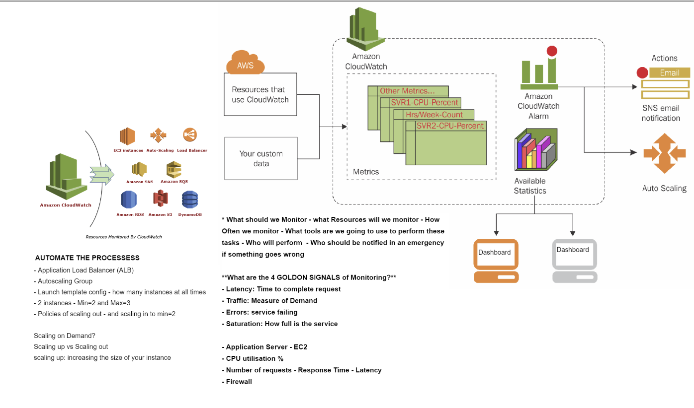
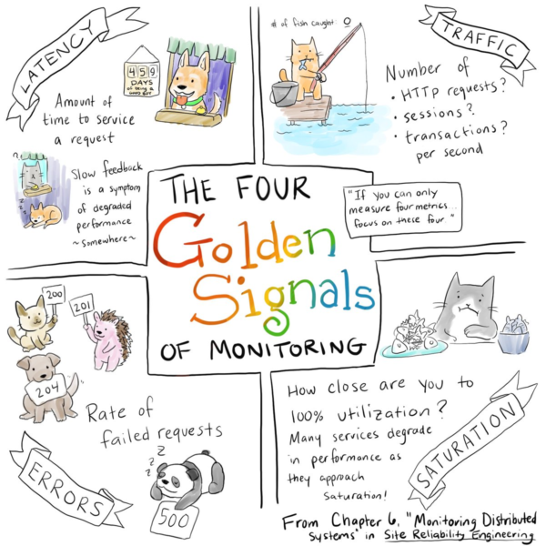

# Monitoring

## Questions to ask before monitoring
- What should we monitor
- What resources will we monitor
- How often should we monitor
- What tools are we going to use to perform these tasks
- Who will perform these tasks
- Who should be notified in an emergency if something goes wrong

## 4 Golden signals of monitoring

- Latency: is the time that it takes to service a request
- Traffic: is the amount of activity in the application
- Errors: are the rate of requests that are failing
- Saturation: is how "full" your service is

## Amazon services that can be monitored using Cloudwatch
- EC2 Instances
- Auto-Scaling
- Load Balancer
- Amazon SNS
- Amazon SQS
- Amazon RDS
- Amazon S3
- DynamoDB

## Automate the process
- Application Load Balancer (ALB)
- Autoscaling Group
- Launch template config - how many instances at all times
- 2 instances - Min=2 abd Max=3
- Policices of scaling out - and scaling in to Min=2 instances

### Scaling on Demand
- Scaling up vs Scaling out
- Scaling up: increasing the size of your instance
- Scaling out = adding more of the same components in parallel to spread out a load. Scaling up = making a component bigger or faster so that it can handle more load.

## Types of notifications sent once alarm goes off
- Lambda
- SQS   
- HTTP/s
- Email
- SMS

# AWS Simple Storage Service (S3)
S3 buckets are globally available and not to a specific region
## To Create AWS CLI:
The AWS Command Line Interface (CLI) is a unified tool to manage your AWS services. With just one tool to download and configure, you can control multiple AWS services from the command line and automate them through scripts.
- Dependencies: python3 with any other required
- AWS access and secret keys
- S3 access through our IAM role/account - apply CRUD: Create - Read - Update - Delete

## Data Percistencies

## commands used to create S3 bucket
'''
- sudo apt-get update
- sudo apt-get upgrade -y
- sudo apt-get install python-pip -y
- sudo pip install awscli -y
- python --version
- sudo apt install python3-pip -y
- alias python=python3 (to let the interpreter what version to use)
- sudo pip3 install awscli
- aws --version
- aws configure (connected ec2 instance to s3 bucket in aws)
Default region name [None]: eu-west-1, Default output format [None]: json
- aws s3 ls (check available s3 buckets created in aws)
- aws s3 mb s3://devops-mohammed-bootcamp --region eu-west-1 (create a s3 bucket)
- aws s3 ls
- sudo nano test.md `# s3 storage data creted on ec2 to be uploaded to s3`
- aws s3 cp test.md s3://devops-mohammed-bootcamp/ (copied file from ec2 instance to bucket)
- sudo rm -rf test.md
- aws s3 cp s3://devops-mohammed-bootcamp/test.md . (to copy file from bucket to ec2 instance)
- aws s3 sync s3://devops-mohammed-bootcamp/ test (another method to copy all files into a folder called test from s3 bucket)
- aws s3 rm s3://devops-mohammed-bootcamp -- recursive (to delete all files within s3 bucket)
- aws s3 rb s3://devops-mohammed-bootcamp (remove/delete s3 bucket from aws)
'''

### AWSCLI
- AWSCLI can be used to create any `aws` resources required

## Autoscaling and Load balancing requirements to achieve high availability and scalability
- ASG: Launch Template or Launch Configuration (auto scaling group)
- ALB: Target group HTTP 80, port 3000
- AWS Keys
- VPC - Subnets - SG
- Type of instance
- AMI-id, Node-app AMI 
- EBS storage
- autoscaling group to launch node app with min:2 desired:2 max:3 ec2s in multi AZs
- Use the user data option to run the script to launch nodeapp without DB in your first iteration - second iteration: connect to DB using DB AMI Cloudwatch to launch autoscaling group
- SNS to send an email if COU usage exceeds the critical amount